# Sensitive-door flow

What the system does, end to end, when a badge opens a `sensitivity: high` door.

Today that is one door: **`D-SERVER`** — the Server Room, `hours: [7, 21]` (`doors.json:15`).
Every other door skips Tier B entirely (`rules.js:43`).

## The flow

```mermaid
flowchart TD
    A["Badge scan at Server Room<br/><i>sim/attack.js · console · real reader</i>"] --> B

    B["POST /events<br/><b>server.js:105</b>"] --> C{"Valid shape?<br/>Known door?"}
    C -- no --> C1["400 INVALID_EVENT"]:::grey
    C -- yes --> D{"Credential revoked?<br/><b>server.js:117</b>"}

    D -- yes --> D1["DENY / REVOKED<br/>engine never runs<br/>position NOT updated"]:::green
    D -- no --> E["Stamp ts = Date.now<br/>attach demo_hour<br/><b>server.js:139</b>"]

    E --> F["evaluate<br/><b>engine.js:53</b>"]
    F --> G{"Credential in registry?"}
    G -- no --> G1["UNKNOWN_CREDENTIAL"]:::amber
    G -- yes --> H

    H{"TIER A · PHYSICS<br/>observed &lt; required × 0.8 ?<br/><b>engine.js:101</b>"}
    H -- "YES · too fast" --> RED
    H -- "NO · or nothing to compare" --> I
    H -.- HX["<i>nothing to compare:</i><br/>no prior scan · same door twice<br/>observed ≤ 0 · pooled pass"]:::note

    RED["<b>ANOMALY</b><br/>CLONED_CREDENTIAL<br/>or CREDENTIAL_SHARED_OR_STOLEN<br/>severity 27.3×"]:::red
    RED --> RED2["Tier B is SKIPPED<br/>red outranks amber<br/><b>engine.js:128</b>"]:::red

    I["TIER B · PLAUSIBILITY<br/>review<br/><b>rules.js:42</b>"] --> J{"door.sensitivity == high ?<br/><b>rules.js:43</b>"}
    J -- no --> OK
    J -- yes --> K{"hour outside 07–21 ?<br/><b>rules.js:55</b>"}

    K -- yes --> K1["+ OFF_HOURS"]:::amber
    K -- no --> L
    K1 --> L

    L{"Shared / pooled pass?<br/><b>rules.js:68</b>"}
    L -- "yes · V-0001" --> N["stop here<br/>no personal history to check"]
    L -- no --> M1

    M1{"Open session?<br/>getSession<br/><b>store.js:62</b>"}
    M1 -- "no perimeter scan" --> M1a["+ NO_ENTRY_PATH<br/><i>tailgated in</i>"]:::amber
    M1 -- yes --> M2
    M1a --> M2

    M2{"Opened this door before?<br/>hasUsedDoor<br/><b>store.js:79</b>"}
    M2 -- no --> M2a["+ FIRST_USE"]:::amber
    M2 -- yes --> N
    M2a --> N

    N --> O{"Any findings?"}
    O -- no --> OK
    O -- yes --> AMBER["<b>REVIEW</b> · amber<br/><b>engine.js:132</b>"]:::amber

    OK["<b>OK</b> · green"]:::green

    RED2 --> S
    AMBER --> S
    OK --> S

    S["UPDATE STATE<br/><i>always last — rules ask what was true BEFORE</i><br/><b>engine.js:148</b>"]
    S --> S1["perimeter door → openSession<br/>setLastSeen · markDoorUsed<br/><i>skipped for pooled passes</i>"]
    S1 --> S2[".state.json every 2s<br/><b>persistence.js:57</b><br/><i>survives restart</i>"]

    S2 --> T{"Verdict?"}

    T -- ANOMALY --> U1["bumpAnomaly · SSE push · red card<br/>writeAnomaly → Firestore<br/><b>firestore.js</b>"]:::red
    U1 --> U2["FCM topic 'anomalies'<br/>→ phone banner"]:::red
    U2 --> U3["Operator taps REVOKE<br/><b>AnomalyRepository.kt</b><br/>writes credentials.revoked = true"]:::red
    U3 --> U4["onSnapshot listener<br/><b>server.js:405</b><br/>registry updated"]:::red
    U4 --> U5["Next scan → DENY<br/><i>loop closed</i>"]:::green

    T -- REVIEW --> V1["bumpReview · SSE push · amber card<br/>NO revoke · NO phone push"]:::amber
    V1 --> V2["shouldWriteReview<br/><b>store.js</b><br/><i>person+door+rules, 4h</i>"]:::amber
    V2 -- "first time" --> V3["writeReview → Firestore<br/>→ phone amber list, read-only"]:::amber
    V2 -- repeat --> V4["console only<br/><i>no doc</i>"]:::amber

    T -- OK --> W1["bumpScan · SSE 'scan'<br/>Last check panel<br/>figure moves on plan"]:::green

    classDef red fill:#3b1418,stroke:#e0484f,color:#ffd9dc
    classDef amber fill:#3a2e12,stroke:#e0a838,color:#ffe9b8
    classDef green fill:#12301e,stroke:#3fbf70,color:#c8f5da
    classDef grey fill:#24262b,stroke:#6b7280,color:#d1d5db
    classDef note fill:#1b2430,stroke:#5b7089,color:#cbd5e1
```

## The five scenarios

| # | Who | When | Result | Revokes? |
|---|---|---|---|---|
| 1 | `B-4471` cloned badge, Lobby → Server in **4.0s** | any time | ANOMALY / `CLONED_CREDENTIAL`, 27.3x | yes, one tap |
| 2 | `B-4472` Priya, never badged in, never been here | **03:00** | `OFF_HOURS + NO_ENTRY_PATH + FIRST_USE` | no |
| 3 | same badge, **clicked again** | 03:00 | `OFF_HOURS + NO_ENTRY_PATH` — `FIRST_USE` gone | no |
| 4 | `V-0001` visitor pass | 03:00 | `OFF_HOURS` **alone** | no |
| 5 | `B-4471` after revoke | any | `DENY / REVOKED` — engine never runs | already dead |

Reproduce 2-4 from the console: `/debug/reset`, then **Night mode · 03:00**, then click **Server Room**.
Scenario 3 is the one to show a judge — clicking the same door twice drops `FIRST_USE`, which proves
findings are recomputed per scan, not cached.

## The three rules

| Rule | Asks | Backed by | Fires when |
|---|---|---|---|
| `OFF_HOURS` | is it inside `hours`? | `door.hours` from `doors.json` | outside 07:00-21:00. Applies to pooled passes too — a room has hours even when nobody owns the badge |
| `NO_ENTRY_PATH` | did this body badge in? | `sessions` Map, `store.js:28` | no `perimeter: true` scan on record. Session dies after 4h of silence. Means they tailgated |
| `FIRST_USE` | has this person been here? | `doorHistory` Map, `store.js:31` | door not in their Set. Fires once per person per door, then never again |

## Three things that are load-bearing

**Red outranks amber.** `engine.js:128` runs Tier B only when the verdict is not already `ANOMALY`.
An alert that says both "impossible" and "unusual" buries the half that matters.

**State updates last.** `engine.js:148` sits below the rules deliberately. Both `FIRST_USE` and
`NO_ENTRY_PATH` ask what was true *immediately before* the scan. Move the update above them and
both rules go permanently silent, with no error and no crash.

**Revoke is one tap, not automatic.** `server.js:146` writes the anomaly, bumps stats and pushes —
it does not call `setRevoked`. A human presses the button on the phone or console. CLAUDE.md
describes Tier A as "auto-revokes"; that is the design intent, but the shipped code keeps a person
in the loop.

## Where the amber goes

A `REVIEW` raises an amber card on the operator console, bumps the Reviews lamp, and — the first time
a person trips a given rule set at a given door — lands a doc in `reviews`. The phone shows those in a
**read-only** list below the red ones.

Three things hold that path together:

- **`engine.js` defaults `reason` to `TIER_B_REVIEW`.** It used to be `undefined`, which made
  `writeReview` throw on every non-pooled review and kept the collection accidentally empty.
- **`store.shouldWriteReview()` dedupes the Firestore write**, keyed on person + door + sorted rule
  set, for a session's 4h. Tier B still has no dedupe of its own — `NO_ENTRY_PATH` re-fires on every
  scan — and the SSE push is still ungated, because the console flicker is the signal.
- **No push, no revoke button.** Amber is not proof. `pushAnomaly` stays wired to `writeAnomaly`
  only, and `Review` in `Models.kt` carries no credential id, so there is nothing to revoke from.
