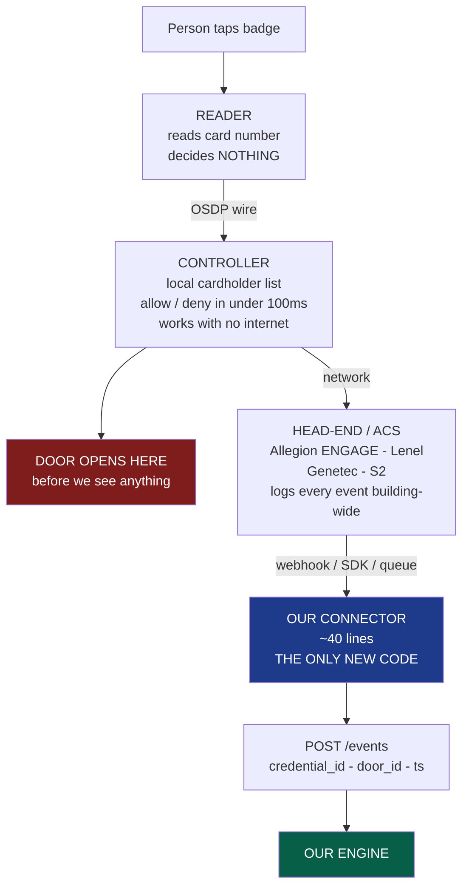
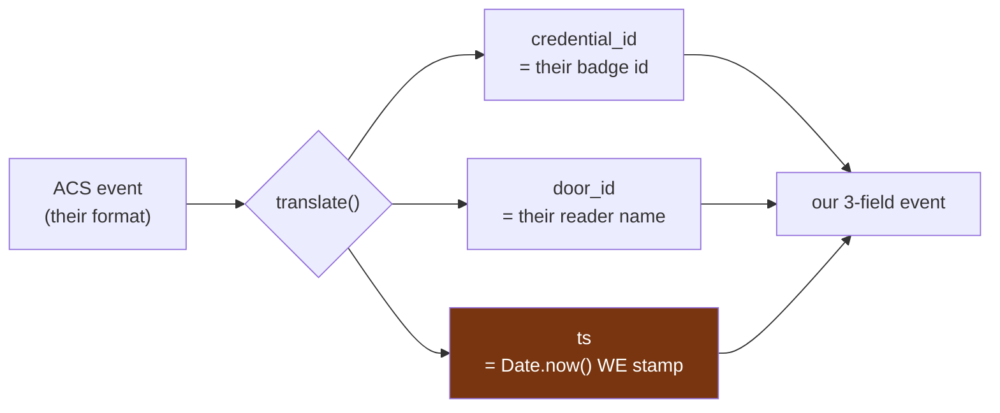
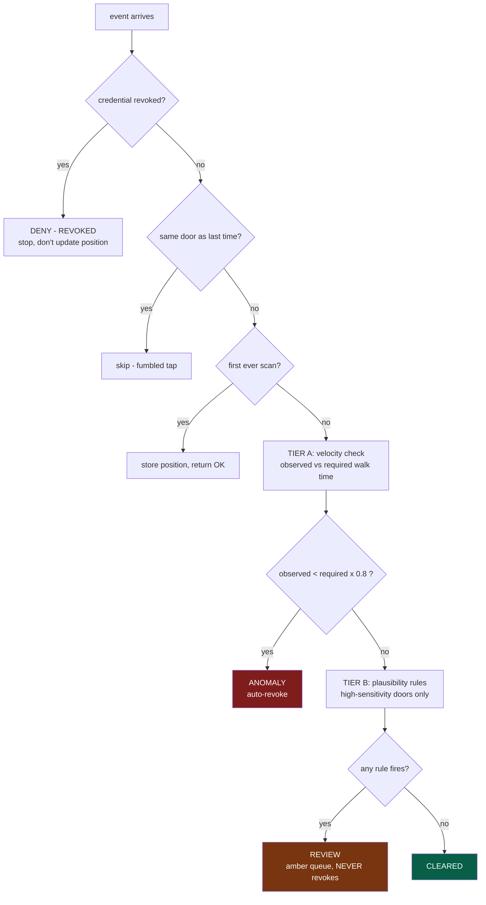
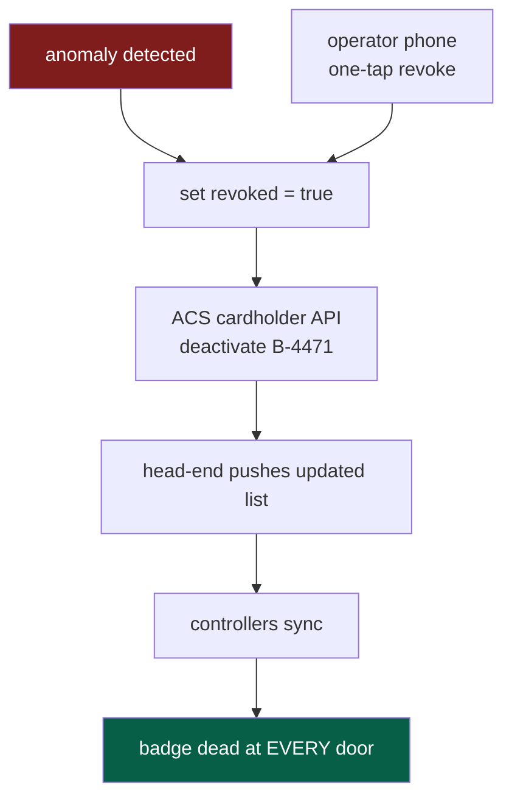
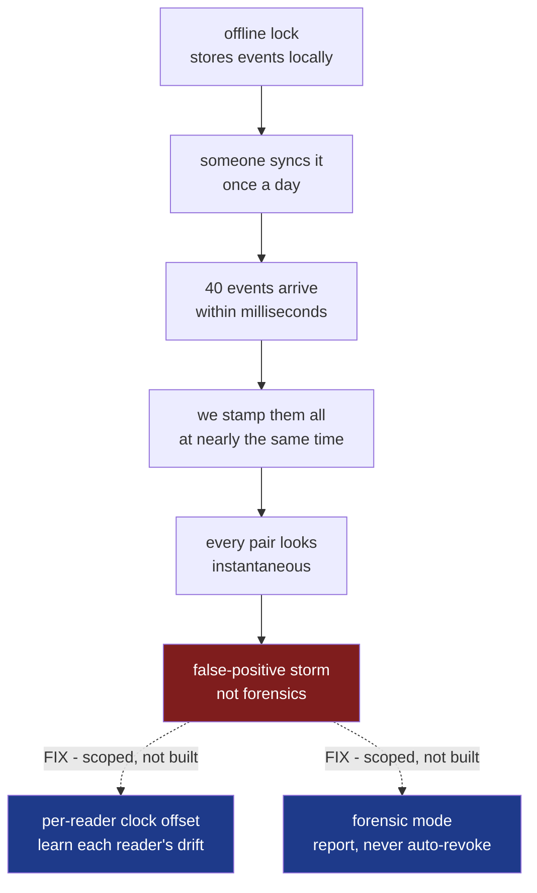

# Demo answers — "How do you integrate with the real lock?"

Pull this up when the judge panel asks about hardware integration.

---

## The three lines to memorise

1. **"We don't integrate with the lock — nobody can. We subscribe to the head-end feed that already exists."**
2. **"Three fields: who, which door, when. That's the whole integration surface."**
3. **"The door already opened locally before we see it. So we kill the next door, not this one."**

---

## The ten-second answer

> "We don't integrate with the lock — nobody can. We subscribe to the head-end's event feed,
> which already logs every badge tap in the building. One small connector maps their event
> format to our three fields. The door already opened locally before we see it, so we alert
> and revoke the credential, which kills the next door instead of the current one."

---

## The chain, explained

### A lock is dumb
A lock is a motor and a magnet. No internet. No trustworthy clock. No GPS — it does not know
where it is. It knows one thing: unlock now, or stay locked.

### The reader sees the badge
Small box beside the door. Reads the number on your card. **Decides nothing.** Forwards the
number down a wire using **OSDP** — the standard language between readers and controllers.

### The controller is the brain
One cupboard, 8–16 doors. Holds a local copy of the cardholder list. Card taps → check list →
fire the motor. **Under 100ms, with no internet.** Buildings are legally required to work when
the network dies, so the decision is always local.

### The head-end is the log book
The server that collects every badge event from every controller. Brand names: **Allegion
ENGAGE**, **Lenel**, **Genetec**, **S2**. It already stores who badged, which door, what time,
allowed or denied.

**Key point:** that data already exists. Every building with electronic locks already produces
it. Nobody has to build it.

---

## Master flowchart



- Blue box is the only code we write per customer.
- Red box marks why we alert instead of block — the door is already open.
- Green box is our engine, which never changes between installs.

---

## Where we plug in

Three ways head-ends offer their feed. Every major brand supports at least one:

- **Webhook** — the ACS calls our URL each time someone badges.
- **SDK / API** — we poll or subscribe using their library.
- **Message queue** — events land on a queue, we read the queue.

---

## What the connector does



```javascript
// the whole integration surface
function translate(acsEvent) {
  return {
    credential_id: acsEvent.cardholderBadgeId,  // who
    door_id:       acsEvent.readerName,         // which door
    ts:            Date.now()                   // when - WE stamp it
  };
}
```

- **credential_id** and **door_id** come straight from their event.
- **ts** is stamped by us, not taken from the reader.
- Reader clocks drift. A reader 60s slow would fake a teleport.
- Door locations are **not** here — walk times live in our `doors.json`, mapped once at install.
- `sim/` produces exactly this shape, so the swap is drop-in.

| Field | Meaning | Comes from |
|---|---|---|
| `credential_id` | which badge | the ACS event |
| `door_id` | which door | the ACS event |
| `ts` | when we saw it | we stamp it |

---

## Inside the engine



- **Tier A** is physics. A proof. So it is allowed to revoke.
- **Tier B** is heuristics. A guess. So it only raises amber, never revokes.
- Only **too fast** ever flags. Slower is always fine.
- Red outranks amber — if both match, only the anomaly is emitted.
- Detection is keyed by **person**, not credential. Physics applies to bodies.

---

## Why we alert instead of blocking

By the time our engine sees the event, **the door is already open**. The controller decided
locally, before the event ever left the building.

Could we sit in the decision path instead? No:

- It would add a network round-trip to every single door open.
- If our server crashed, every door in the building would freeze.
- Fire codes and building regulations do not allow that.

So our output is **alert + revoke the credential**. We stop the **next** door, not this one.

---

## The revoke path back



- Same chain as the forward path, travelling upward.
- We call the ACS's normal cardholder API. Nothing exotic.
- Sync is seconds on modern panels, minutes on old offline hardware.

---

## The offline-lock gap — say it BEFORE they find it



Naming your own gap reads as confidence, not weakness.

---

## Allegion specifics, if they push

- **ENGAGE** gateways already carry Schlage NDE, LE and Control lock events up to the ACS.
- **AD-Series** and **Mercury** panels stream events into Lenel, Genetec and S2.
- We attach to that existing stream.

Payoff line: **no firmware change, no lock change, no door downtime, no rewiring.**
We are read-only on a feed that already exists.

Keep product names high-level unless the judge is an Allegion hardware engineer.

---

## ASCII version — for slides with no Mermaid renderer

```
  taps badge
       |
       v
  +-------------+
  |   READER    |  reads number, decides nothing
  +------+------+
         | OSDP
         v
  +-------------+
  | CONTROLLER  |  local list - under 100ms - offline-capable
  +------+------+
         +-----------> DOOR OPENS  <-- already open before we see it
         | network
         v
  +---------------------------------+
  |   HEAD-END / ACS                |  ENGAGE - Lenel - Genetec - S2
  |   already logs every event      |
  +------+--------------------------+
         | webhook / SDK / queue
         v
  +-------------+
  |  CONNECTOR  |  ~40 lines - ONLY new code
  +------+------+
         | { credential_id, door_id, ts }
         v
  +---------------------------------+
  |  ENGINE                         |
  |   Tier A velocity -> revoke     |
  |   Tier B rules    -> review     |
  +------+--------------------------+
         | revoked = true
         v
  +-------------+
  | ACS API     | --> controllers sync --> badge dead everywhere
  +-------------+
```

---

## Other boundaries worth having ready

- **Door coordinates** come from `doors.json`, not the lock. Locks have no GPS.
- **Tailgating** is not detectable as an intrusion — no second scan, nothing to compare.
  Tier B's `NO_ENTRY_PATH` sees its trace later, if the tailgater then opens a sensitive door.
- **Nothing is authenticated** in the demo. `POST /events` and the revoke route are both open.
  First thing to fix before real deployment.
- **A patient attacker beats Tier A entirely.** Coverage is layered, not complete.
- **The app is admin by intent, not enforcement.** No login. Real fix is Firebase Auth with an
  `operator` claim plus revoke behind a privileged function.
