# How a badge scan becomes an alert

One scan, start to finish. Every decision the backend makes, in order.

```mermaid
flowchart TD
    A["Badge scanned at a door<br/>POST /events"] --> B{"Request shape valid?<br/>credential_id + door_id"}
    B -->|no| B1["400 INVALID_EVENT"]
    B -->|yes| C{"Door exists in doors.json?"}
    C -->|no| C1["400 UNKNOWN_DOOR"]

    C -->|yes| D{"Credential already revoked?"}
    D -->|yes| D1["DENY / REVOKED<br/>engine never runs<br/>position NOT updated"]
    D -->|no| E["Stamp time server-side<br/>ts = Date.now"]

    E --> F{"Credential in registry?"}
    F -->|no| F1["UNKNOWN_CREDENTIAL"]
    F -->|yes| G{"Pooled pass?<br/>shared = true"}

    G -->|"yes — visitor / contractor"| TB
    G -->|no| H["Look up this PERSON's<br/>last known position<br/>keyed by person_id"]

    H --> I{"Any previous position?"}
    I -->|"no — first ever scan"| TB
    I -->|yes| J{"Different door<br/>from last time?"}
    J -->|"no — fumbled re-tap"| TB
    J -->|yes| K["observed = now − last scan time<br/>required = walk seconds from<br/>the Floyd–Warshall table"]

    K --> L{"observed > 0<br/>AND<br/>observed < required x 0.8 ?"}
    L -->|"no — slow enough for a human"| TB
    L -->|"yes — nobody walked that"| M{"Same credential_id<br/>at both doors?"}

    M -->|yes| N["🔴 ANOMALY<br/>CLONED_CREDENTIAL<br/>the card was copied"]
    M -->|no| O["🔴 ANOMALY<br/>CREDENTIAL_SHARED_OR_STOLEN<br/>two credentials, one body"]

    TB{"Door marked<br/>sensitivity: high?"}
    TB -->|no| OK["✅ OK"]
    TB -->|yes| P["Run plausibility checks"]

    P --> P1{"Outside the door's hours?"}
    P1 -->|yes| PF["collect finding<br/>OFF_HOURS"]
    P1 -->|no| P2
    PF --> P2{"Pooled pass?"}
    P2 -->|"yes — skip person rules"| V
    P2 -->|no| P3{"No perimeter entry<br/>this session?"}
    P3 -->|yes| PF2["collect finding<br/>NO_ENTRY_PATH"]
    P3 -->|no| P4
    PF2 --> P4{"Never opened<br/>this door before?"}
    P4 -->|yes| PF3["collect finding<br/>FIRST_USE"]
    P4 -->|no| V
    PF3 --> V

    V{"Any findings?"}
    V -->|no| OK
    V -->|yes| W["🟡 REVIEW<br/>amber queue<br/>never revokes"]

    N --> S
    O --> S
    W --> S
    OK --> S

    S{"Pooled pass?"}
    S -->|"yes — not a body, track nothing"| OUT
    S -->|no| S1{"Perimeter door?"}
    S1 -->|yes| S2["Open presence session"]
    S1 -->|no| S3
    S2 --> S3["Save position for this person<br/>Mark door as used"]
    S3 --> OUT

    OUT["Emit result"]
    OUT --> OUT1["Console log"]
    OUT --> OUT2["SSE push → operator console"]
    OUT --> OUT3["Firestore write → Android app"]

    OUT3 --> R1["Human reads the alert"]
    R1 --> R2["One-tap revoke in the app"]
    R2 --> R3["Firestore credentials.revoked = true"]
    R3 --> R4["Backend watcher picks it up<br/>next scan hits the DENY branch"]

    classDef red fill:#7f1d1d,stroke:#ef4444,color:#fff
    classDef amber fill:#78350f,stroke:#f59e0b,color:#fff
    classDef green fill:#14532d,stroke:#22c55e,color:#fff
    classDef grey fill:#374151,stroke:#9ca3af,color:#fff
    class N,O red
    class W,PF,PF2,PF3 amber
    class OK green
    class B1,C1,D1,F1 grey
```



---

## The two tiers on the chart

| | Tier A — red | Tier B — amber |
|---|---|---|
| On the chart | the `observed < required x 0.8` branch | the `sensitivity: high` branch |
| File | [`engine.js`](backend/engine.js) | [`rules.js`](backend/rules.js) |
| Basis | physics — a proof | plausibility — a guess |
| Catches | attacker in a hurry | patient attacker |
| Runs on | every door | `D-SERVER` only |
| Revokes | no (a human does) | never |

**Red outranks amber.** Tier B only runs when Tier A stayed silent — [`engine.js:108`](backend/engine.js#L108). An alert that says both "impossible" and "unusual" buries the half that matters.

**Tier B runs before the position is saved.** `NO_ENTRY_PATH` and `FIRST_USE` both ask what was true *immediately before* this scan.

---

## Three scenarios traced through the chart

**Cloned badge** — `node attack.js`

```
9:00:00  B-4471  Lobby        valid → not revoked → not pooled → no previous → save → OK
9:00:04  B-4471  Server Room  valid → not revoked → not pooled → previous = Lobby
                              different door ✓
                              observed 4   required 110   4 < 88 ✓
                              same credential_id ✓
                              → CLONED_CREDENTIAL, severity 27x
```

**Stolen phone** — `node attack.js --steal`

```
9:00:00  B-4471  Lobby        badge, person E-1123 → save
9:00:04  M-9902  Server Room  phone, SAME person E-1123 → reads what the badge wrote
                              observed 4   required 110   4 < 88 ✓
                              different credential_id
                              → CREDENTIAL_SHARED_OR_STOLEN
```

**Visitor pass** — `node attack.js --pooled`

```
9:00:00  V-0001  Lobby        shared = true → skips physics entirely → OK, no position saved
9:00:04  V-0001  Annex        shared = true → skips physics entirely → OK
                              → no alert. Correct: many bodies legitimately use this card.
```

---

## Things on the chart that are easy to miss

**Revoked scans never reach the engine, and never update position.** [`server.js:95`](backend/server.js#L95). Deliberate: a killed badge must not poison the tracked position of the employee still carrying their other credential.

**Timestamps are stamped here, not at the reader.** [`server.js:110`](backend/server.js#L110). Reader clocks drift — one reader 60s behind its neighbour would manufacture anomalies out of nothing.

**Pooled passes are skipped twice.** Once at the physics check, once at the state update. If a visitor pass wrote a position, the next real holder's physics would be computed against a stranger's location.

**Revocation is not automatic.** The chart's bottom branch is real: alert → human → app → Firestore → backend watcher. There is no code path where the engine revokes on its own.
