# Detection flow — Mermaid diagrams

Two diagrams. Lead with the story. Hold the complete map in reserve.

---

## Diagram 1 — the story (use this first)

One badge, two doors, four seconds. A judge follows this in 15 seconds.

```mermaid
flowchart TD
    START["🕐 11:43:43.1<br/>Ravi Sharma taps badge B-4471<br/>at the LOBBY door"]

    START --> S1["server.js<br/>✓ shape looks valid<br/>✓ stamps time 11:43:43.1<br/>ignores the reader's own clock"]
    S1 --> S2{"is B-4471 revoked?"}
    S2 -->|"no — valid badge"| E1["engine.js<br/>'where was Ravi last?'"]

    E1 --> M1["store.js<br/>'never seen him before'"]
    M1 --> R1["✅ CLEARED<br/>nothing to compare yet"]
    R1 --> SAVE1["store.js remembers:<br/>Ravi · LOBBY · 11:43:43.1"]

    SAVE1 --> GAP["⏳ 4 seconds pass"]

    GAP --> START2["🕐 11:43:47.1<br/>badge B-4471 taps again<br/>at the SERVER ROOM door<br/>three floors up"]

    START2 --> S3["server.js<br/>stamps time 11:43:47.1"]
    S3 --> S4{"is B-4471 revoked?"}
    S4 -->|"still no"| E2["engine.js<br/>now it asks TWO questions"]

    E2 --> M2["store.js<br/>'LOBBY, 4.0 seconds ago'"]
    E2 --> G1["graph.js<br/>'LOBBY to SERVER ROOM?'"]
    G1 --> D1["doors.json<br/>25s corridor<br/>+ 55s lift to Level 3<br/>+ 30s hallway"]
    D1 --> G2["graph.js answers:<br/>⏱️ 110 seconds minimum"]

    M2 & G2 --> COMPARE{"engine.js compares:<br/>took 4.0s<br/>needs 110s<br/>flags under 88s"}

    COMPARE -->|"4.0 is way under 88"| ANOM["🔴 ANOMALY<br/>CLONED_CREDENTIAL<br/>27.3x too fast<br/>no human body can do this"]

    COMPARE -.->|"if it had taken 95s instead"| RULES["rules.js would run<br/>3 plausibility checks"]
    RULES -.-> AMBER["🟠 REVIEW — amber<br/>suspicious, but not proof<br/>NEVER revokes"]

    ANOM --> OUT1["📺 operator console<br/>red card + two bodies<br/>drawn on the floor plan"]
    ANOM --> OUT2["firestore.js<br/>writes the alert<br/>+ fires phone push"]

    OUT2 --> PHONE["📱 guard's phone buzzes<br/>'Impossible travel — Ravi Sharma'<br/>within ~1 second"]

    PHONE --> TAP["👆 guard taps REVOKE"]
    TAP --> FS["☁️ Firestore<br/>B-4471 revoked = true"]
    FS --> WATCH["firestore.js on the backend<br/>hears the change instantly"]
    WATCH --> M3["store.js<br/>B-4471 marked dead"]

    M3 --> NEXT["🕐 11:44:02<br/>the clone tries another door"]
    NEXT --> S5{"is B-4471 revoked?"}
    S5 -->|"YES — now it is"| BLOCKED["🚫 DENY · REVOKED<br/>loop closed"]

    style ANOM fill:#7f1d1d,color:#fff
    style BLOCKED fill:#065f46,color:#fff
    style R1 fill:#065f46,color:#fff
    style AMBER fill:#92400e,color:#fff
    style COMPARE fill:#1e3a8a,color:#fff
    style G2 fill:#1e3a8a,color:#fff
    style PHONE fill:#1e3a8a,color:#fff
```

### Narrate it in five beats

1. **The first tap looks totally normal.** Nothing to compare against yet. Every access
   system on earth does exactly this.
2. **Four seconds later, the same badge opens the Server Room.** A normal reader asks one
   question — *is this badge valid?* Yes. Door opens. A clone passes that test at every
   door, forever. That is the whole problem.
3. **We ask the second question.** store.js says he was in the Lobby 4 seconds ago.
   graph.js says that walk is 110 seconds — 25s corridor, 55s lift, 30s hall.
4. **The verdict writes itself.** No body covers 110 seconds of walking in 4 seconds. Not a
   risk score. Arithmetic. That is why we are allowed to auto-revoke.
5. **The loop closes in under a second.** Phone buzzes, one tap, badge dead building-wide.

### The line to land

> "Everyone checks *is this badge valid*. We check *could this person physically be here*.
> Four seconds, a 110-second walk. That's not suspicious — that's impossible."

---

## Diagram 2 — every branch, with file and line

Use only if a judge asks about false positives, visitors, or edge cases.

```mermaid
flowchart TD
    IN["POST /events<br/>credential_id + door_id"]

    IN --> V["server.js:105 app.post('/events')<br/>server.js:106 EventSchema.safeParse — zod"]
    V --> Q1{"shape valid?"}
    Q1 -->|no| E1["400 INVALID_EVENT<br/>server.js:108"]
    Q1 -->|yes| Q2{"door in doors.json?<br/>server.js:110 · isKnownDoor<br/>graph.js:87"}

    Q2 -->|no| E2["400 UNKNOWN_DOOR<br/>server.js:111"]
    Q2 -->|yes| Q3{"badge revoked?<br/>server.js:118 · store.isRevoked<br/>store.js:216"}

    Q3 -->|yes| DENY["🔴 DENY · REVOKED<br/>server.js:118-128<br/>never reaches engine<br/>never updates position"]
    Q3 -->|no| STAMP["server.js:139<br/>evt.ts = Date.now<br/>WE stamp the time"]

    STAMP --> EVAL["engine.js:340<br/>evaluate(evt)"]
    EVAL --> Q4{"badge in registry?<br/>engine.js:341 · store.getCredential<br/>store.js:190"}

    Q4 -->|no| UNK["🟠 UNKNOWN_CREDENTIAL<br/>engine.js:344<br/>not in our list"]
    Q4 -->|yes| Q5{"is it a SHARED pass?<br/>engine.js:359 · cred.shared"}

    Q5 -->|"yes — visitor / contractor"| POOL["engine.js:359-363 POOLED_CREDENTIAL<br/>prev = null → physics cannot fire<br/>engine.js:435 no position saved<br/>rules.js:518 person-rules skipped<br/>BUT rules.js:497 OFF_HOURS still runs"]

    Q5 -->|"no — a real body"| PREV["engine.js:363<br/>prev = store.getLastSeen<br/>store.js:143"]

    PREV --> Q6{"any previous scan?"}
    Q6 -->|no| FIRST["🟢 FIRST_SCAN<br/>engine.js:361<br/>store it, return OK"]
    Q6 -->|yes| Q7{"same door as last time?<br/>engine.js:367"}

    Q7 -->|yes| SAME["🟢 SAME_DOOR<br/>engine.js:368<br/>fumbled tap, skip"]
    Q7 -->|no| CALC["engine.js:370-371<br/>observed = now minus prev<br/>required = minTravelSeconds<br/>graph.js:64 → doors.json"]

    CALC --> Q8{"observed is 0 or less?<br/>engine.js:388"}
    Q8 -->|yes| OOO["🟢 OUT_OF_ORDER<br/>engine.js:379<br/>jitter, not an attack"]
    Q8 -->|no| Q9{"observed under required x 0.8?<br/>engine.js:388<br/>TOLERANCE engine.js:329"}

    Q9 -->|no| LEGAL["🟢 LEGAL_WALK<br/>engine.js:379<br/>took long enough"]
    Q9 -->|yes| Q10{"same badge at both doors?<br/>engine.js:396 · prev.via_cred"}

    Q10 -->|yes| CLONE["🔴 CLONED_CREDENTIAL<br/>engine.js:332<br/>the card was COPIED"]
    Q10 -->|no| STEAL["🔴 SHARED_OR_STOLEN<br/>engine.js:333<br/>badge + phone, one person<br/>revoking both locks out<br/>the real employee"]

    CLONE --> OUT["server.js:145-157<br/>stats.bumpAnomaly + SSE push<br/>firestore.js:149 writeAnomaly<br/>firestore.js:40 pushAnomaly → 📱"]
    STEAL --> OUT

    POOL --> TB
    FIRST --> TB
    SAME --> TB
    OOO --> TB
    LEGAL --> TB
    UNK -.-> TB

    TB["engine.js:415 — only if NOT an anomaly<br/>rules.js:492 review()<br/>rules.js:493 high-sensitivity doors ONLY<br/>· OFF_HOURS rules.js:497<br/>· NO_ENTRY_PATH rules.js:520 → store.js:162<br/>· FIRST_USE rules.js:527 → store.js:179"]

    CLONE -.->|"red outranks amber<br/>anomalies skip Tier B"| TB
    STEAL -.->|" "| TB

    TB --> Q11{"any rule fired?"}
    Q11 -->|no| CLEAR["🟢 CLEARED<br/>server.js:169<br/>push type 'scan'"]
    Q11 -->|yes| REVIEW["🟠 REVIEW · amber<br/>engine.js:418 · server.js:160-167<br/>NEVER revokes"]

    CLEAR --> AFTER
    REVIEW --> AFTER
    OUT --> AFTER

    AFTER["AFTERWARDS — every non-shared outcome<br/>engine.js:438 perimeter? → openSession store.js:174<br/>engine.js:440 setLastSeen — refuses older ts store.js:150<br/>engine.js:445 markDoorUsed store.js:181<br/>persistence.js:60 every 2s → .state.json<br/>firestore.js:281 every 10s → stats/live"]

    style DENY fill:#7f1d1d,color:#fff
    style CLONE fill:#7f1d1d,color:#fff
    style STEAL fill:#7f1d1d,color:#fff
    style UNK fill:#92400e,color:#fff
    style REVIEW fill:#92400e,color:#fff
    style POOL fill:#3730a3,color:#fff
    style FIRST fill:#065f46,color:#fff
    style SAME fill:#065f46,color:#fff
    style OOO fill:#065f46,color:#fff
    style LEGAL fill:#065f46,color:#fff
    style CLEAR fill:#065f46,color:#fff
    style E1 fill:#374151,color:#fff
    style E2 fill:#374151,color:#fff
    style TB fill:#1e3a8a,color:#fff
    style AFTER fill:#374151,color:#fff
```

### Colour key

- 🔴 **Red** — proof. Physics says impossible. Auto-revokes.
- 🟠 **Amber** — a guess. Human queue. Never revokes.
- 🟢 **Green** — fine, nothing to do.
- 🔵 **Blue** — Tier B rules engine.
- 🟣 **Indigo** — the pooled-pass exemption.
- ⚫ **Grey** — rejected input, or bookkeeping.

### Reading the arrows

- **Solid** — the event flows this way.
- **Dotted from CLONE and STEAL** — they *skip* Tier B. Red outranks amber, so an anomaly
  never also raises a review.
- **Dotted from UNKNOWN_CREDENTIAL** — returns early, never reaches the rules.

---

## The file map behind both diagrams

| File | Its one job in this flow |
|---|---|
| `server.js` | Validate, stamp time, block revoked, fan out results |
| `engine.js` | Tier A physics — the 40 lines that are the product |
| `graph.js` | Answer "how long is that walk?" instantly |
| `store.js` | Remember where everyone was, and which badges are dead |
| `rules.js` | Tier B guesses — amber only, never revokes |
| `doors.json` | The map, the walk seconds, the sensitivity flags |
| `firestore.js` | Write the alert, push to the phone |
| `persistence.js` | Survive a restart |

---

## Three ordering facts worth saying out loud

- **Revoked is checked before the engine** (`server.js:118`). A dead badge never updates a
  position, so it cannot poison the real employee still carrying their phone.
- **Tier B runs before the state updates** (`engine.js:415` before `:435`). Both rules ask
  what was true *immediately before* this tap.
- **`OFF_HOURS` is pushed before the shared early-return** (`rules.js:497` before `:518`).
  That is the only way a visitor pass can raise an amber flag.

---

## Why the boring branches exist

Each one exists because removing it breaks the demo.

- **UNKNOWN_CREDENTIAL** — a badge not in the registry. Without it the engine hits a null.
- **REVOKED first** — a killed badge must not move the position of the employee still
  carrying their other credential.
- **SHARED pass** — many bodies legitimately use one visitor badge. Person-physics would
  flag it constantly.
- **SAME_DOOR** — people fumble taps. Without the skip, every double-tap is a 0-second
  "impossible walk".
- **OUT_OF_ORDER** — network jitter can deliver events backwards. Negative time is not an
  attack.
- **CLONED vs SHARED_OR_STOLEN** — different fixes. Revoking both credentials on a
  stolen-phone case locks out the innocent employee.
- **Red outranks amber** — an alert saying both "impossible" and "unusual" buries the half
  that matters.

---

## If the diagram is too wide for one slide

Split diagram 2 at `STAMP`:

- **Slide 1 — the gate.** `POST /events` down to `evt.ts = Date.now()`.
  Title: *"before we think: validate, block revoked, stamp the clock."*
- **Slide 2 — the decision.** `evaluate()` down to the outcomes.
  Title: *"Tier A is a proof. Tier B is a guess."*
